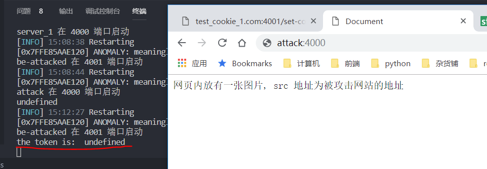

# cookie 相关实验

## CSRF

跨站请求攻击，简单地说，是攻击者通过一些技术手段欺骗用户的浏览器去访问一个自己曾经认证过的网站并运行一些操作（如发邮件，发消息，甚至财产操作如转账和购买商品）。由于浏览器曾经认证过，所以被访问的网站会认为是真正的用户操作而去运行。这利用了web中用户身份验证的一个漏洞：简单的身份验证只能保证请求发自某个用户的浏览器，却不能保证请求本身是用户自愿发出的。

[CSRF](https://zh.wikipedia.org/wiki/%E8%B7%A8%E7%AB%99%E8%AF%B7%E6%B1%82%E4%BC%AA%E9%80%A0)

### 验证过程

在 hosts 文件添加两个用于测试的域名, hosts 文件的位置一般在 `C:\Windows\System32\drivers\etc\hosts`.
做完测试后记得删掉, 以免不能正常访问网站.
```
127.0.0.1 csrf-attack.com
127.0.0.1 csrf-be-attacked.com
```

依次执行执行以下命令, 启动两个服务.
```
yarn install
yarn run start
```

我们先直接访问攻击站点: `csrf-attack.com:4000`

可以看到, 没有 cookie 发送到被攻击站点.

然后我们访问被攻击站点 `csrf-be-attacked.com:4001/set-token` 来模拟登陆, 将 token 写入浏览器.


这时候我们再去访问 `csrf-attack.com:4000`
可以看到被攻击站点接收到了 cookie 的请求


可以想象, 黑客可以诱骗用户先登陆被攻击网站, 然后再把用户诱骗到自己的站点, 在自己的站点用隐藏的图片, 或者其他能发送请求的标签(link, script)来攻击用户的账户.